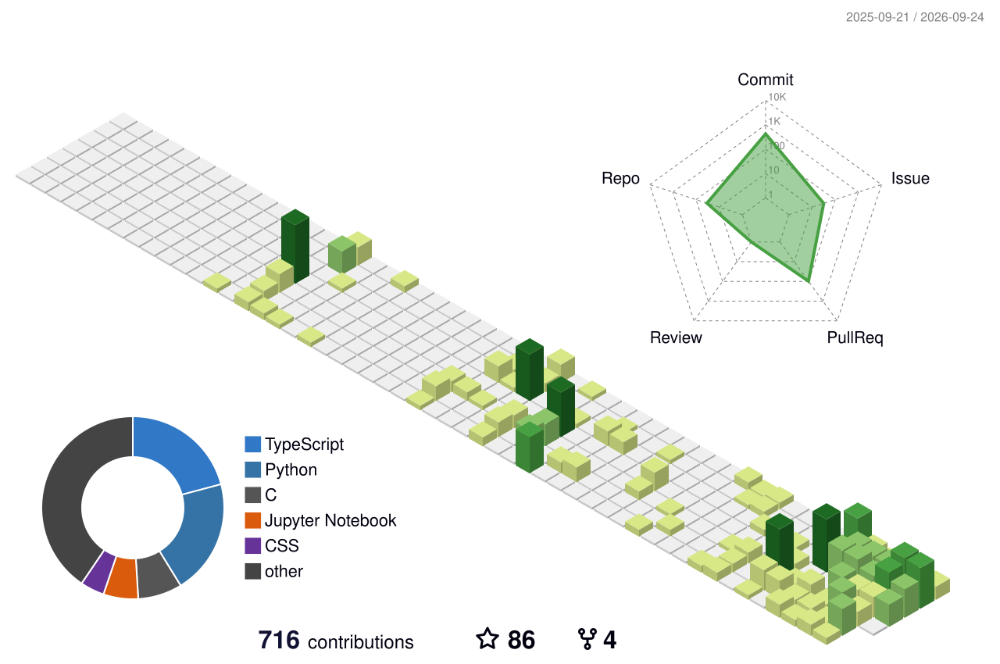

### About Me

- **ML / DL / LLM**
- **CS Specialist** at the **University of Toronto**.
- **Knowledge is Human**.

---

### Languages and Tools

<div align="center">
  
  
  
  
  
  
  
  
  
</div>

---

### Github Contributions

<div align="center">
  <picture>
    <source media="(prefers-color-scheme: dark)" srcset="https://raw.githubusercontent.com/austinchennn/austinchennn/output/github-contribution-grid-snake-dark.svg">
    <source media="(prefers-color-scheme: light)" srcset="https://raw.githubusercontent.com/austinchennn/austinchennn/output/github-contribution-grid-snake.svg">
    
  </picture>
  
  <br/>
  
  <picture>
    <source media="(prefers-color-scheme: dark)" srcset="profile-3d-contrib/profile-night-view.svg">
    <source media="(prefers-color-scheme: light)" srcset="profile-3d-contrib/profile-green-animate.svg">
    
  </picture>
</div>

---

### Coding Activity

<!--START_SECTION:waka-->

```txt
Java              11 hrs 16 mins        ⣿⣿⣿⣿⣿⣿⣿⣿⣿⣿⣿⣶⣀⣀⣀⣀⣀⣀⣀⣀⣀⣀⣀⣀⣀   46.94 %
Markdown          8 hrs 12 mins         ⣿⣿⣿⣿⣿⣿⣿⣿⣦⣀⣀⣀⣀⣀⣀⣀⣀⣀⣀⣀⣀⣀⣀⣀⣀   34.17 %
Other             1 hr 22 mins          ⣿⣦⣀⣀⣀⣀⣀⣀⣀⣀⣀⣀⣀⣀⣀⣀⣀⣀⣀⣀⣀⣀⣀⣀⣀   05.72 %
Python            1 hr 16 mins          ⣿⣤⣀⣀⣀⣀⣀⣀⣀⣀⣀⣀⣀⣀⣀⣀⣀⣀⣀⣀⣀⣀⣀⣀⣀   05.29 %
HTML              20 mins               ⣤⣀⣀⣀⣀⣀⣀⣀⣀⣀⣀⣀⣀⣀⣀⣀⣀⣀⣀⣀⣀⣀⣀⣀⣀   01.40 %
```

<!--END_SECTION:waka-->
